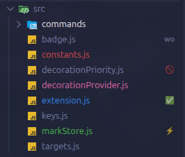

# File Marks

Colour your files and folders in the VS Code Explorer. Right-click → **Mark** — pick a colour, a
tag and a note. Marks are stored globally, so they follow you into every project.

[](https://marketplace.visualstudio.com/items?itemName=T0ks1k24.file-marks)
[](https://marketplace.visualstudio.com/items?itemName=T0ks1k24.file-marks)
[](https://marketplace.visualstudio.com/items?itemName=T0ks1k24.file-marks&ssr=false#review-details)
[](LICENSE)



## Why

- Find the files you actually work in, in a tree full of everything else.
- No config files in your repo, nothing committed by accident.
- Works on a multi-selection, on folders, and on remote / WSL / container workspaces.
- No runtime dependencies, no network access, no telemetry.

## Install

From the Extensions view (`Ctrl+Shift+X`) search for **File Marks**, or:

```
ext install T0ks1k24.file-marks
```

Also on [Open VSX](https://open-vsx.org/extension/T0ks1k24/file-marks) for VSCodium, Cursor and
Gitpod.

## Use it

Right-click a file or folder in the Explorer (or an editor tab) → **Mark**:

| | |
|---|---|
| **Quick Preset…** | colour + tag + note in one click — TODO, Important, Broken… |
| **Colour…** | 10 colours, themeable |
| **Tag / Badge…** | 1–2 characters or an emoji next to the name |
| **Description…** | note shown on hover |
| **Remove** | clear the mark |
| **List All Marks** | jump to any marked file |

Everything is also in the Command Palette under `File Marks:`.

The eight presets that ship with it — 📌 TODO, ⭐ Important, 🚧 In progress, ✅ Done, 💥 Broken,
🚫 Do not touch, ❓ Question, 🗄 Archive — are only a starting point. Replace them with your own
workflow through `fileMarks.presets`.

## Settings

| Setting | Default | What it does |
|---|---|---|
| `fileMarks.presets` | 8 presets | the ready-made marks in **Quick Preset…** — replace them with your own |
| `fileMarks.badgeSuggestions` | `[]` | the tags offered in the picker; empty keeps the built-in emoji |
| `fileMarks.propagateToParents` | `false` | colour a folder when something inside it is marked |
| `fileMarks.showTagInTooltip` | `true` | put the tag in front of the note in the hover text |
| `fileMarks.priorityOverGit` | `true` | keep mark colours in front of git status colours |

Change the colours to your own:

```jsonc
"workbench.colorCustomizations": {
  "fileMarks.red": "#ff0055"
}
```

Available ids: `fileMarks.red`, `.orange`, `.yellow`, `.green`, `.teal`, `.blue`, `.purple`,
`.pink`, `.grey`, `.white`.

## Good to know

**A tag is 1–2 characters** — one emoji counts as one, so `📌`, `🇺🇦` and `🚧✅` all fit. Longer
input is cut down to the first two: `work` becomes `wo`.

That is not our choice. VS Code gives the spot next to a file name exactly two characters and
rejects anything longer — the badge is not truncated for you, the whole decoration is thrown away
and the file loses its colour as well. Use the hover note for anything that needs words.

**Git colours.** VS Code keeps the colour of whichever extension registered last, so File Marks
re-registers itself after Git has started. If a colour still gets overridden, run
**File Marks: Give Marks Priority Over Git Colours**. On a folder containing changed files, Git
replaces the badge with a grey dot; the mark colour stays. Problem markers (errors, warnings)
always win — turn them off if marks must be unconditionally visible:

```jsonc
"git.decorations.enabled": false,
"problems.decorations.enabled": false
```

**Renames** made inside VS Code carry the mark along, folders included. Changes made outside the
editor do not — use **File Marks: Remove Marks of Missing Files** to clean up.

**Backup.** *Export / Import Marks* moves everything to another machine. Marks live in one JSON
file in the extension's global storage; nothing is written into your projects.

## Contributing

Bugs and ideas are welcome in the [issues](https://github.com/T0ks1k24/vscode-file-marks/issues).
The extension is plain JavaScript with no build step: clone it, press `F5`, and a second VS Code
window opens with it loaded.

```bash
npm install
npm run check      # syntax check
npm run package    # build file-marks.vsix
```

Pushing a commit to `main` with a new `version` in `package.json` tags it and publishes the
release automatically — see [.github/workflows/release.yml](.github/workflows/release.yml).

## Licence

MIT © T0ks1k24 · [Source](https://github.com/T0ks1k24/vscode-file-marks) ·
[Changelog](CHANGELOG.md)
