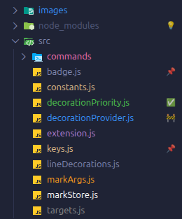
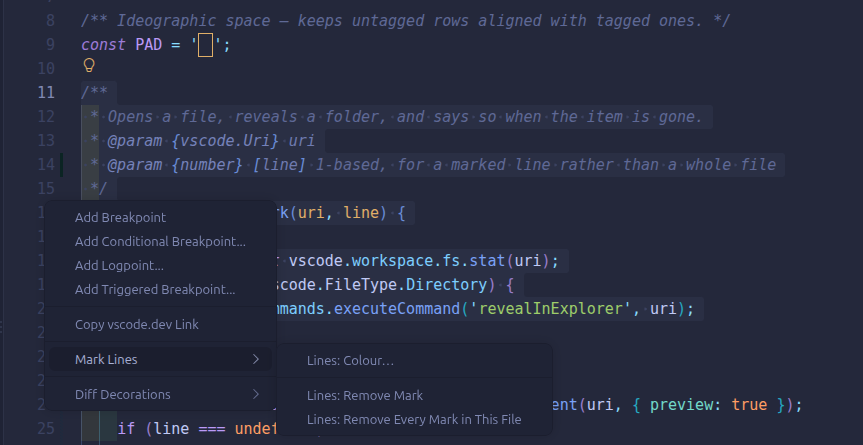
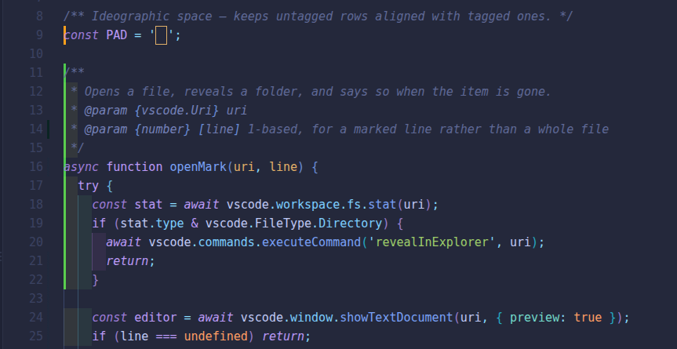

# File Marks Explorer

Colour your files and folders in the VS Code Explorer. Right-click → **Mark** — pick a colour, a
tag and a note. Marks are stored globally, so they follow you into every project.

[](https://marketplace.visualstudio.com/items?itemName=T0ks1k24.file-marks-explorer)
[](https://marketplace.visualstudio.com/items?itemName=T0ks1k24.file-marks-explorer)
[](https://marketplace.visualstudio.com/items?itemName=T0ks1k24.file-marks-explorer&ssr=false#review-details)
[](LICENSE)



## Why

- Find the files you actually work in, in a tree full of everything else.
- No config files in your repo, nothing committed by accident.
- Works on a multi-selection, on folders, and on remote / WSL / container workspaces.
- No runtime dependencies, no network access, no telemetry.

## Install

From the Extensions view (`Ctrl+Shift+X`) search for **File Marks Explorer**, or:

```
ext install T0ks1k24.file-marks-explorer
```

Also on [Open VSX](https://open-vsx.org/extension/T0ks1k24/file-marks-explorer) for VSCodium, Cursor and
Gitpod.

## Use it

Right-click a file or folder in the Explorer (or an editor tab) → **Mark**:

| | |
|---|---|
| **Quick Preset…** | colour + tag + note in one click — TODO, Important, Broken… |
| **Colour…** | 10 colours, themeable |
| **Tag / Badge…** | 1–2 characters or an emoji next to the name |
| **Description…** | note shown on hover |
| **Remove** | clear the mark |
| **List All Marks** | jump to any marked file |

Everything is also in the Command Palette under `File Marks:`.

The eight presets that ship with it — 📌 TODO, ⭐ Important, 🚧 In progress, ✅ Done, 💥 Broken,
🚫 Do not touch, ❓ Question, 🗄 Archive — are only a starting point. Replace them with your own
workflow through `fileMarks.presets`.

## Lines, not just files

Select some code, right-click the **line numbers** → **Mark Lines** → **Colour…**:



The lines get a stripe in that colour where the numbers end, and a tick in the overview ruler so you
can find them from anywhere in the file. The code itself is left alone — nothing is highlighted or
recoloured:



| | |
|---|---|
| **Colour…** | paint the selected lines |
| **Remove Mark** | take the stripe off them |
| **Remove Every Mark in This File** | clear the file in one go |

Right-clicking a line number inside a selection marks the whole selection; right-clicking outside one
marks that single line. All three are in the Command Palette too, where they work on whatever is
selected.

Marks follow the text while you edit: everything below an insertion or a deletion moves with it, and
a mark on a line you delete goes away with the line. Edits made outside VS Code are not seen — marks
are stored by line number, not by content — so a file rewritten by another tool can end up with its
stripes a few lines off.

Clearing the mark of a *file* leaves the lines inside it alone; they are separate work. **Delete All
Marks** removes both.

## Keybindings

One press. They act on the file open in the editor, and on the Explorer selection while the
Explorer has focus.

| | |
|---|---|
| `Ctrl+Alt+1` … `Ctrl+Alt+5` | apply preset 1–5 — colour, tag and note in one go |
| `Ctrl+Alt+0` | remove the mark |
| `Ctrl+Alt+M` | the preset picker — everything else is in there |
| `Ctrl+Alt+C` | colour… |
| `Ctrl+Alt+L` | list all marks |

Press the same shortcut again and the mark comes off, so `Ctrl+Alt+1` is a toggle.

The shortcuts are bound to key *positions* (`[Digit1]`, `[KeyM]`), not to the letters printed on
them, so they keep working on a Ukrainian, Russian, Greek or any other non-Latin layout — where a
plain `alt+m` binding does nothing at all, because no key on that layout produces an `m`.

### Bind your own

`fileMarks.apply` takes arguments, so any mark can go on a key of your own in `keybindings.json`:

```jsonc
{
  "key": "ctrl+alt+r",
  "command": "fileMarks.apply",
  "args": { "color": "red", "badge": "💥", "description": "Broken" }
}
```

| Argument | Accepts |
|---|---|
| `color` | `red`, `orange`, `yellow`, `green`, `teal`, `blue`, `purple`, `pink`, `grey`, `contrast`, any theme colour id, or `null` to clear it |
| `badge` | 1–2 characters, or `null` |
| `description` | any text, or `null` |
| `preset` | a position in `fileMarks.presets` (`1`) or its label (`"TODO"`) |
| `toggle` | `false` to keep writing the mark instead of taking it off on the second press |
| `target` | `"explorer"` marks the Explorer selection instead of the file in the editor |

With no `args` at all the key opens the preset picker.

## Settings

| Setting | Default | What it does |
|---|---|---|
| `fileMarks.presets` | 8 presets | the ready-made marks in **Quick Preset…** — replace them with your own |
| `fileMarks.badgeSuggestions` | `[]` | the tags offered in the picker; empty keeps the built-in emoji |
| `fileMarks.propagateToParents` | `false` | colour a folder when something inside it is marked |
| `fileMarks.showTagInTooltip` | `true` | put the tag in front of the note in the hover text |
| `fileMarks.priorityOverGit` | `true` | keep mark colours in front of git status colours |
| `fileMarks.explorerKeybindings` | `true` | let the shortcuts mark the Explorer selection |
| `fileMarks.lineMarkWidth` | `3` | width in pixels of the stripe beside a marked line |

Change the colours to your own:

```jsonc
"workbench.colorCustomizations": {
  "fileMarks.red": "#ff0055"
}
```

Available ids: `fileMarks.red`, `.orange`, `.yellow`, `.green`, `.teal`, `.blue`, `.purple`,
`.pink`, `.grey`, `.white`.

## Good to know

**A tag is 1–2 characters** — one emoji counts as one, so `📌`, `🇺🇦` and `🚧✅` all fit. Longer
input is cut down to the first two: `work` becomes `wo`.

That is not our choice. VS Code gives the spot next to a file name exactly two characters and
rejects anything longer — the badge is not truncated for you, the whole decoration is thrown away
and the file loses its colour as well. Use the hover note for anything that needs words.

**Git colours.** VS Code keeps the colour of whichever extension registered last, so File Marks
re-registers itself after Git has started. If a colour still gets overridden, run
**File Marks: Give Marks Priority Over Git Colours**. On a folder containing changed files, Git
replaces the badge with a grey dot; the mark colour stays. Problem markers (errors, warnings)
always win — turn them off if marks must be unconditionally visible:

```jsonc
"git.decorations.enabled": false,
"problems.decorations.enabled": false
```

**The Explorer selection behind a keybinding.** VS Code exposes no API for what is selected in the
Explorer. The shortcuts read it through the built-in *Copy Path* command and put the clipboard back
immediately afterwards — set `fileMarks.explorerKeybindings` to `false` and they only ever mark the
file open in the editor, leaving the clipboard alone. The context menu never needs any of this.

**Renames** made inside VS Code carry the mark along, folders included. Changes made outside the
editor do not — use **File Marks: Remove Marks of Missing Files** to clean up.

**Backup.** *Export / Import Marks* moves everything to another machine. Marks live in one JSON
file in the extension's global storage; nothing is written into your projects.

## Contributing

Bugs and ideas are welcome in the [issues](https://github.com/T0ks1k24/vscode-file-marks/issues),
pull requests just as much. Plain JavaScript, no build step: clone it, `npm install`, press `F5`.
[CONTRIBUTING.md](CONTRIBUTING.md) has the rest — where things live, what the code expects of
itself, and how a release is cut.

## Licence

MIT © T0ks1k24 · [Source](https://github.com/T0ks1k24/vscode-file-marks) ·
[Changelog](CHANGELOG.md)
